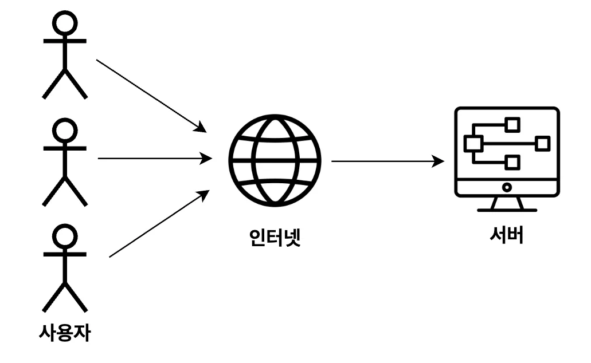

# 배포(Deployment)

## ✅ 배포(Deployment)

> 개발자들은 “이제 기능 구현도 끝났고 테스트도 끝났으니 배포하자!"라는 말을 자주 한다.

여기서 배포란 무슨 뜻일까? 배포(Deployment)란 다른 사용자들이 인터넷을 통해서 사용할 수 있게 만드는 걸 의미한다.

쉽게 얘기해서 우리가 만든 웹 페이지나 서버를 다른 사람들이 사용하려면 인터넷 상에 배포가 돼있어야 한다. 

자신의 컴퓨터에서 개발을 할 때는 localhost라는 주소로 테스트도 하고 개발을 한다. 하지만 이 localhost는 다른 컴퓨터에서는 접근이 불가능한 주소이다. 배포를 하게 되면 IP(ex. 124.16.2.1)나 도메인(ex. www.naver.com)과 같이 고유의 주소를 부여받게 되고, 다른 컴퓨터에서 그 주소로 접속할 수 있게 된다. 이게 바로 배포(Deployment)다. 

따라서 어떤 서비스를 완성했다면, 그 다음 단계로 해야 하는 게 배포(Deployment)이다. 코딩을 배울 때도 기본적인 백엔드 서버를 만들 수 있는 역량이 갖춰졌다면, 그 다음에 배워야 하는 게 배포(Deployment)이다. 

# EC2란?

## ✅ EC2(Elastic Compute Cloud)란? 

> 컴퓨터를 빌려서 원격으로 접속해 사용하는 서비스이다.

> **EC2**를 쉽게 얘기하면 **하나의 컴퓨터**를 의미한다. 

## ✅ EC2(Elastic Compute Cloud)를 왜 배울까?   

서버를 배포하기 위해서는 컴퓨터가 필요하다. 내가 가진 컴퓨터에서 서버를 배포해 다른 사용자들이 인터넷을 통해 접근할 수 있게 만들 수도 있다. 하지만 내 컴퓨터로 서버를 배포하면 24시간 동안 컴퓨터를 켜놔야 한다. 그리고 인터넷을 통해 내 컴퓨터에 접근할 수 있게 만들다보니 보안적으로도 위험할 수도 있다.  

이러한 불편함 때문에 내가 가지고 있는 컴퓨터를 사용하지 않고, AWS EC2라는 컴퓨터를 빌려서 사용하는 것이다. 이 외에도 AWS EC2는 여러 부가기능들(로깅, 오토스케일링, 로드밸런싱 등)을 많이 가지고 있다.

## ✅ 현업에서는 ? 

현업에서도 실제 서버를 배포할 때 AWS EC2를 아주 많이 사용한다. 백엔드 서버를 배포해야 할 때면 EC2에 서버를 배포해서 사용한다. 

> **“그러면 프론트엔드 웹 페이지를 배포할 때는 AWS EC2를 사용하지 않는걸까?”**

프론트엔드 웹 페이지를 배포할 때 AWS EC2를 사용할 수도 있다. 하지만 AWS EC2보다 vercel, netlify 또는 AWS S3를 사용해서 주로 배포한다