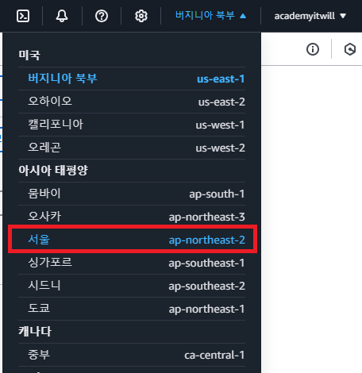
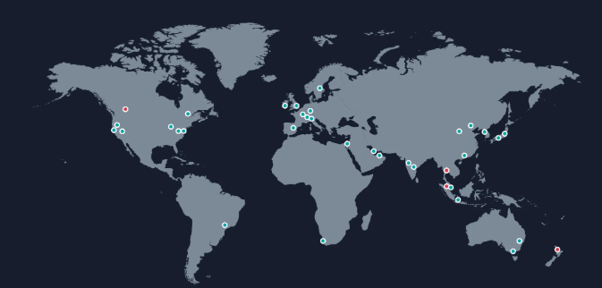
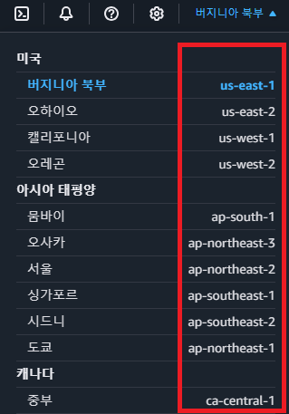

# 1. 리전(Region) 선택하기

### ✅  AWS EC2 서비스로 들어가서 리전(Region) 선택하기

AWS EC2를 시작하기 위해서는 우선적으로 리전(Region)을 먼저 선택해야 한다.

### ✅ 리전(Region)이란?

리전(Region)이란 **인프라를 지리적으로 나누어 배포한 각각의 데이터 센터**를 의미한다.

조금 더 쉽게 풀어서 EC2에 대입해서 생각해보자. 우린 EC2가 컴퓨터를 빌려서 원격으로 접속해 사용하는 서비스라는 걸 알고 있다. 여기서 EC2를 통해 빌려서 쓸 수 있는 컴퓨터들이 전 세계적으로 다양하게 분포해있다. 이렇게 컴퓨터들이 위치한 위치를 보고 AWS에서는 리전(Region)이라고 한다. 

### ✅ 리전(Region)의 특징

1. **AWS는 전 세계적으로 다양한 Region을 보유하고 있다.**

2. **각 Region은 고유의 이름을 가지고 있다.**
 - ex) us-east-1, eu-west-3

 

 ### ✅ 리전(Region)은 어떤 기준으로 선택할까?

사람들이 애플리케이션을 사용할 때는 네트워크를 통해 통신하게 된다. 이 때, 사용자의 위치와 애플리케이션을 실행시키고 있는 컴퓨터와 위치가 멀면 멀수록 속도가 느려진다. 따라서 **애플리케이션의 주된 사용자들의 위치와 지리적으로 가까운 리전(Region)을 선택하는 것이 유리**하다. 

예를 들어, 한국 유저들이 주로 사용하는 서비스를 만들거라면 리전(Region)을 **아시아 태평양(서울)**로 선택하면 된다.

### ✅ 많이 하는 실수

**아시아 태평양(서울)** 리전에서 EC2를 생성해놓고, 실수로 **미국 동부(버지니아 북부) 리전**에 들어가서 생성한 EC2가 없어졌다고 당황하는 경우가 있다. 

리전(Region)마다 EC2가 따로따로 관리가 되고 있으니 이 점 유의하자.