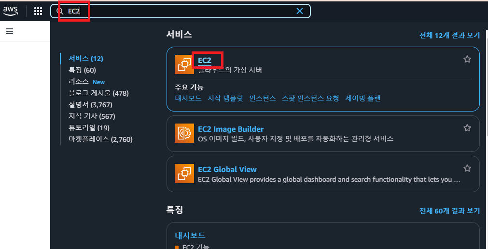
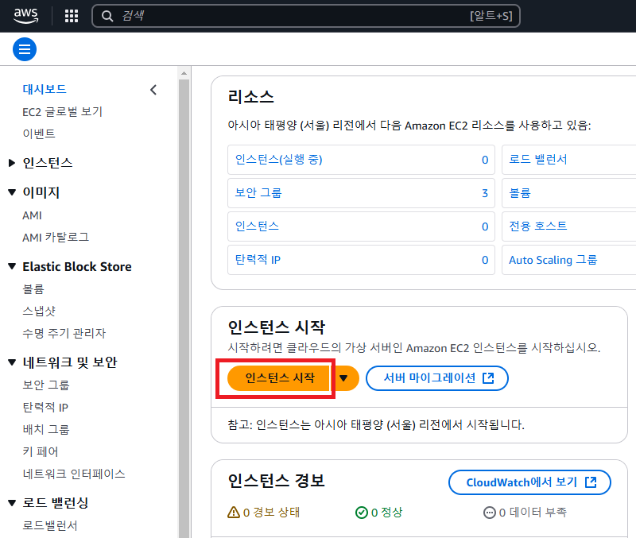
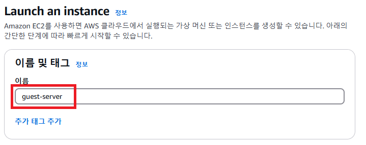
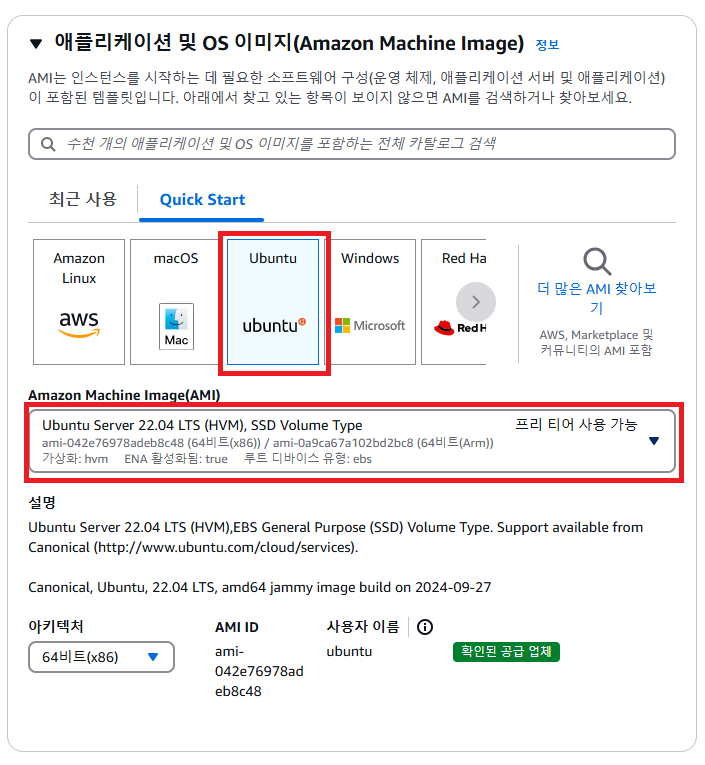
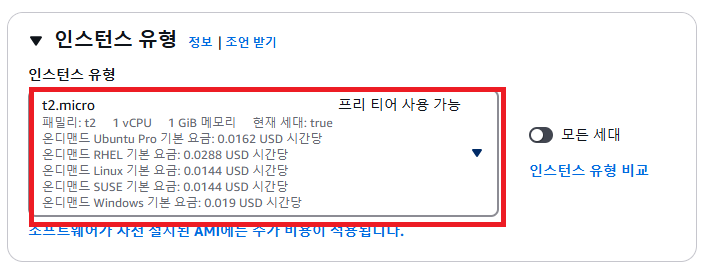
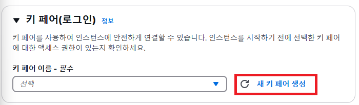
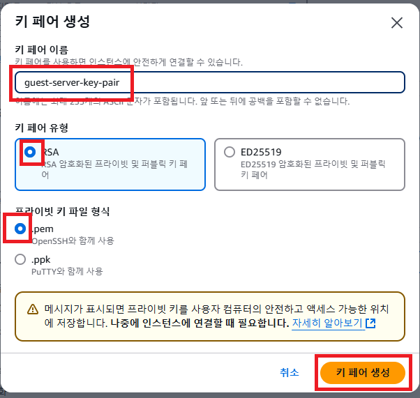

# 2. EC2 셋팅하기 - 기본 설정

### ✅ 1. 이름 및 태그

EC2의 이름을 설정하는 곳이다. 이름을 지을 때는 이 컴퓨터가 어떤 역할을 하는 지 알아볼 수 있게 작성한다. 

ex) `guest-server`

### ✅ 2. Application and OS Images (Amazon Machine Image)

**Ubuntu 22.04 LTS 선택**

OS를 선택하는 단계이다. OS(운영체제)란 Mac, Windows 7, Windows 10, Windows 11 같은 것들이 OS이다. 하지만 Windows나 Mac OS는 생각보다 용량도 많이 차지하고 성능도 많이 잡아먹는다. 그래서 서버를 배포할 컴퓨터의 OS는 훨씬 가벼운 Ubuntu를 많이 사용한다. 

### ✅ 3. 인스턴스 유형

우선 인스턴스라는 뜻부터 정리하고 가자. 인스턴스란, AWS EC2에서 빌리는 컴퓨터 1대를 의미한다. 

그럼 **인스턴스 유형**은 무슨 뜻일까? **컴퓨터 사양을 의미**한다. 컴퓨터 사양이 좋으면 좋을수록 많은 수의 요청을 처리할 수 있고, 무거운 서버나 프로그램을 돌릴 수 있다. 

프리 티어에 해당하는 **t2.micro**를 사용할 것이다.

### ✅ 4. 키 페어(로그인)

키 페어(Key Pair)는 무슨 뜻일까? EC2 컴퓨터에 접근할 때 사용하는 비밀번호라고 생각하면 된다. 말 그대로 열쇠(Key, 키)의 역할을 한다.

- **키 페어 이름**은 어떤 EC2에 접근하기 위한 키 페어였는 지 알아볼 수 있게 지정하면 좋다.

- `RSA`와 `.pem`을 선택한 후에 키 페어를 생성하면 된다. `ED25519`가 뭔지, `.ppk`가 뭔지는 몰라도 된다. 중요하지 않다.

- 키 페어를 생성하면 파일이 하나 다운받아질텐데, 그 파일은 잃어버리면 안 되니 잘 보관해놔야 한다.

