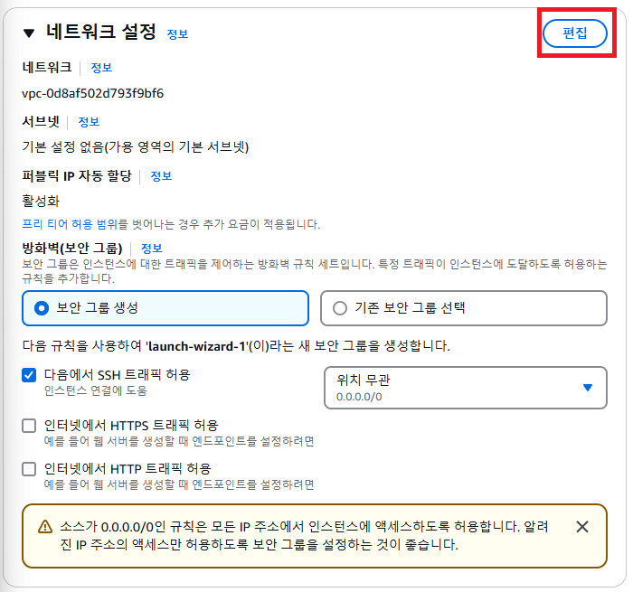
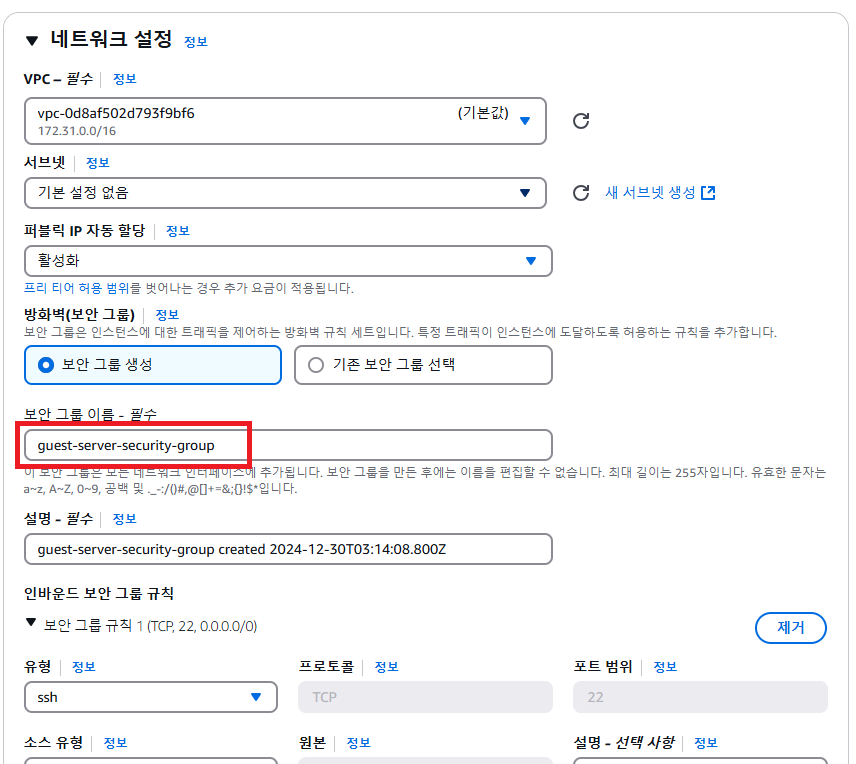
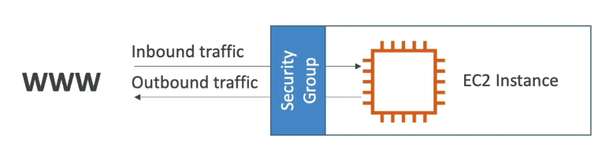
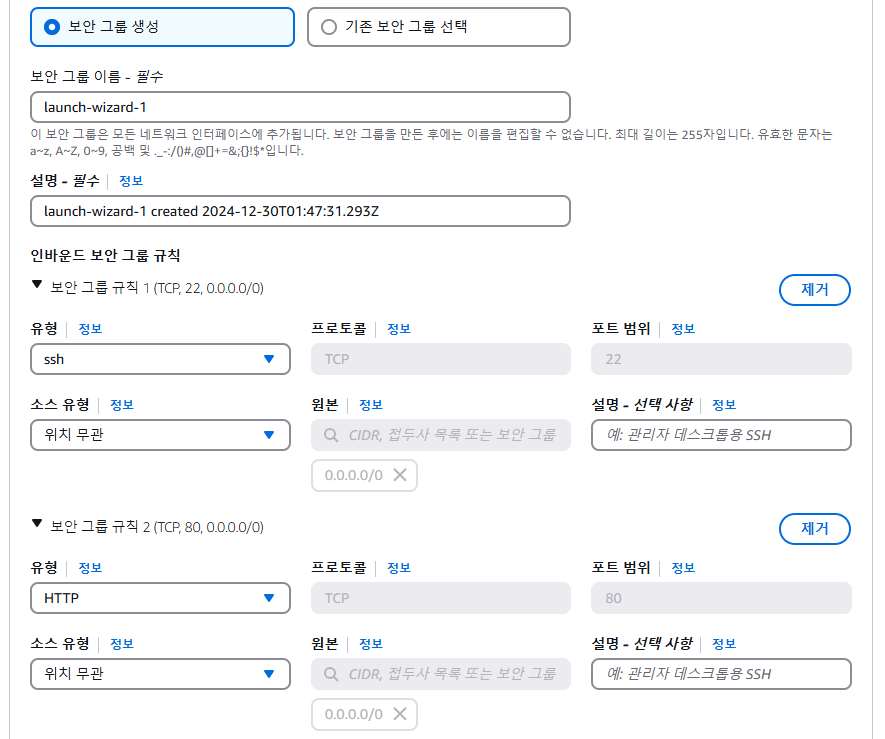

# 3. EC2 셋팅하기 - 보안그룹 설정

### ✅ 네트워크 설정

네트워크 설정 칸을 보면 **VPC**와 **Security Groups(보안 그룹)**가 보인다. 여기서 VPC라는 개념은 AWS를 입문하는 입장에서는 크게 중요하지 않으니 넘어가자. 나중에 AWS에 어느 정도 익숙해졌을 때 VPC를 학습하도록 하자. VPC를 몰라도 서버를 배포하는 데 아무 문제가 없다. 

하지만 **Security Groups(보안 그룹)**은 서버를 배포할 때 중요한 개념이므로 자세히 알아보자.

### ✅ 보안 그룹(Security Group)이란? 

보안 그룹(Security Group)이란 AWS 클라우드에서의 네트워크 보안을 의미한다. 

**EC2 인스턴스**를 **집**이라고 생각한다면, **보안 그룹**은 **집 바깥 쪽에 쳐져있는 울타리와 대문**이라고 생각하면 된다. 집에 접근할 때 울타리의 대문에서 접근해도 되는 요청인지 보안 요원이 검사를 하는 것과 비슷하다. 

인터넷에서 일부 사용자가 EC2 인스턴스에 접근(액세스)하려고 한다고 가정해보자. 위 그림과 같이 EC2 인스턴스 주위에 방화벽 역할을 할 **보안 그룹(Security Group)**을 만들고 보안 그룹에 규칙을 지정한다. 이 보안 규칙에는 **인바운드 트래픽(즉, 외부에서 EC2 인스턴스로 보내는 트래픽)**에서 어떤 트래픽만 허용할 지 설정할 수 있고, **아웃바운드 트래픽(즉, EC2 인스턴스에서 외부로 나가는 트래픽)**에서 어떤 트래픽만 허용할 지 설정할 수 있다. 

보안 그룹을 설정할 때는 허용할 **IP 범위**와 **포트(port)**를 설정할 수 있다.

> **그러면 EC2 인스턴스를 생성할 때 어떻게 보안 그룹(Security Group)을 설정해야 하는 지 알아보자.**

### ✅ 보안그룹 생성 & 설정

외부에서 EC2로 접근할 포트는 22번 포트와 80번 포트라고 생각해서 이 2가지에 대해 인바운드 보안 그룹 규칙을 추가했다. 왜냐하면 22번 포트는 우리가 EC2에 원격 접속할 때 사용하는 포트이고, 80번 포트에는 백엔드 서버를 띄울 예정이기 때문이다. 그리고 어떤 IP에서든 전부 접근할 수 있게 만들기 위해 소스 유형은 위치 무관으로 설정했다. 

