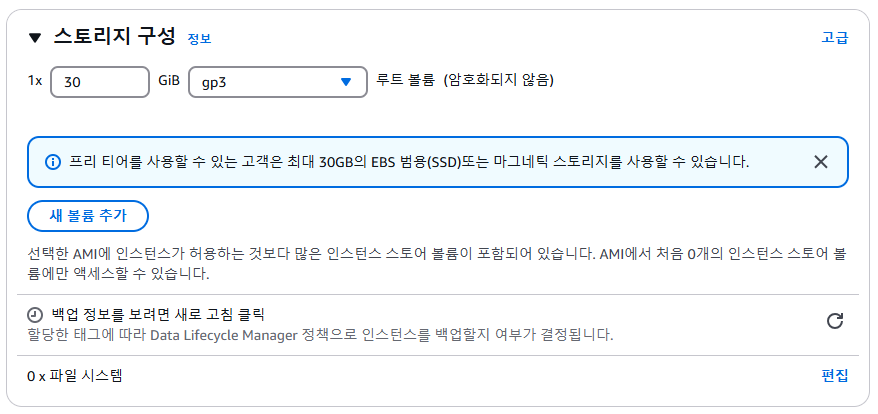
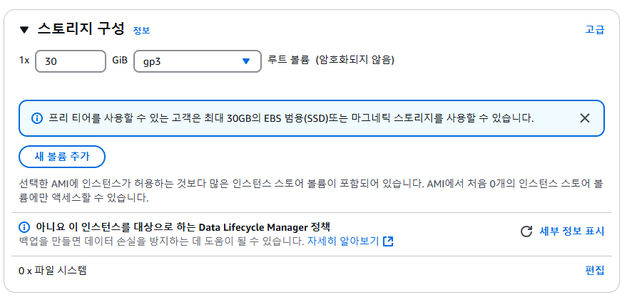
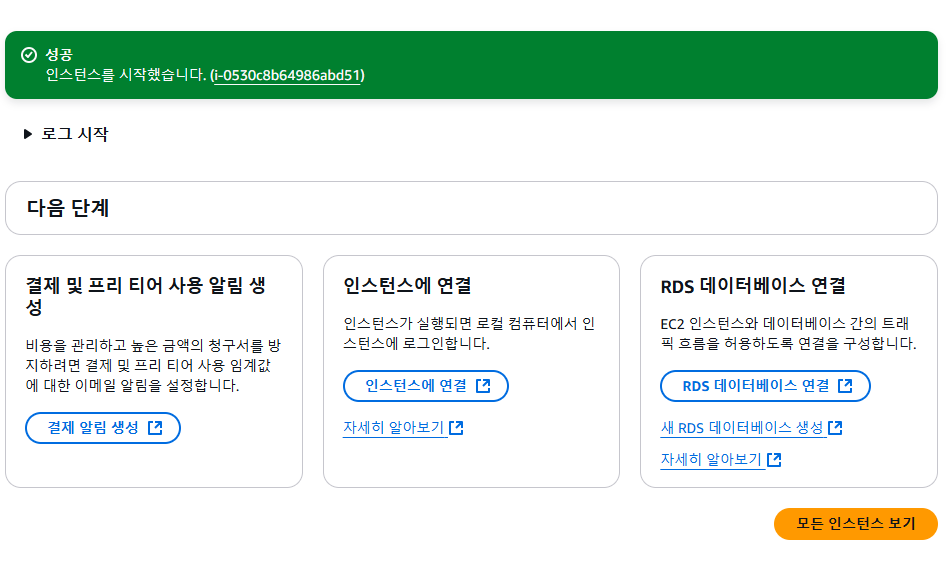

# 4. EC2 셋팅하기 - 스토리지 구성

### ✅ 스토리지 구성

 

> 우리가 쓰고 있는 노트북이나 데스크톱 컴퓨터는 전부 하드디스크를 가지고 있다. 하드디스크는 컴퓨터에서 파일을 저장하는 공간이다. EC2도 하나의 컴퓨터이다보니 여러 파일들을 저장할 저장 공간이 필요하다. 이 저장 공간을 보고 EBS(Elastic Block Storage)라고 부른다. 즉, EBS란 EC2 안에 부착되어 있는 일종의 하드디스크라고 생각하면 된다. EBS와 같은 저장 공간을 조금 더 포괄적인 용어로 스토리지(Storage), 볼륨(Volume)이라고 부른다. 

> 스토리지의 종류를 보면 gp3 이외에도 여러가지 종류의 스토리지가 있다. 하지만 가성비가 좋은 gp3를 선택해주자. 용량을 30GiB를 설정한 이유는 프리 티어에서 30GiB까지 무료로 제공해주기 때문이다. 이 스토리지의 크기는 추후에 늘릴 수도 있으므로 처음 설정할 때 너무 큰 고민을 할 필요는 없다. 

