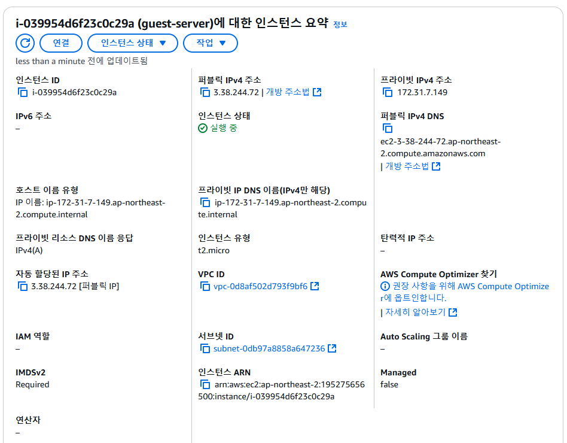
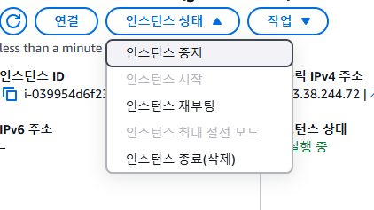
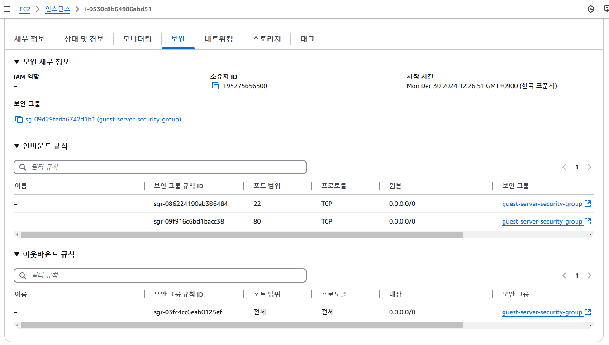
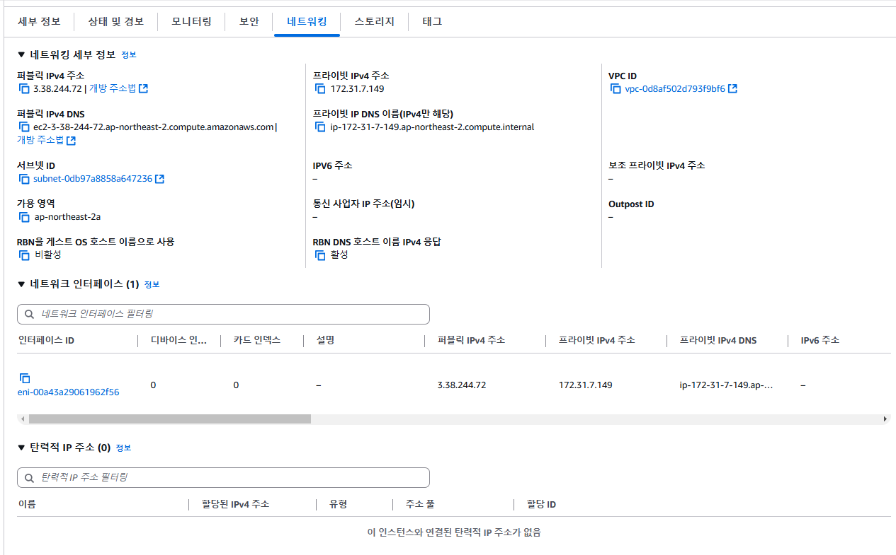
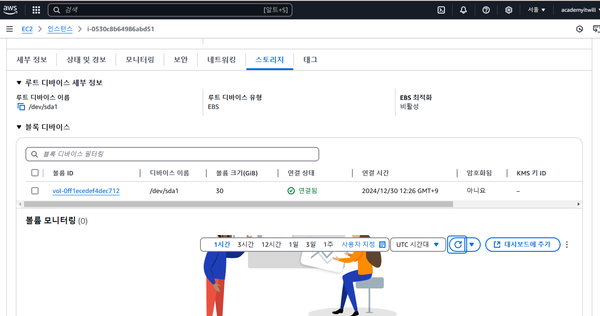
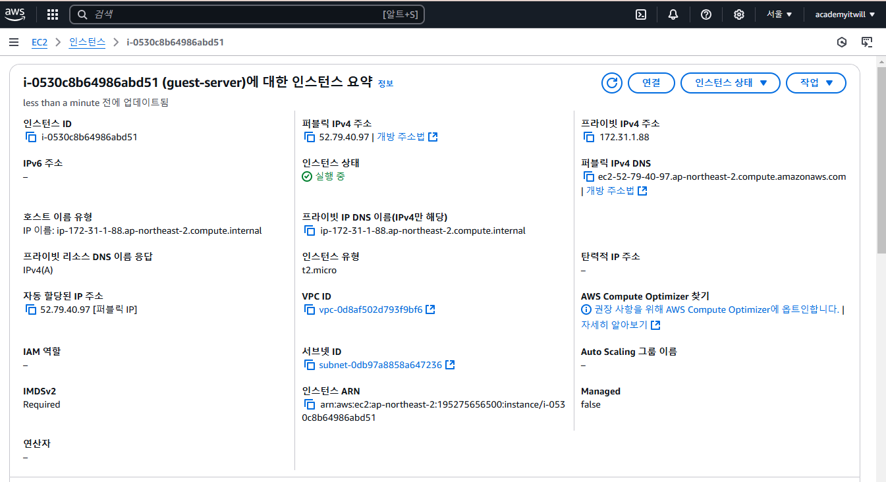

#  5. EC2 접속하기

### ✅ 생성된 인스턴스 정보 해석하기

#### 1.세부 정보

세부 정보에서 눈여겨 봐야 할 부분은 2가지 밖에 없다. **퍼블릭 IPv4 주소**와 **인스턴스 상태**이다. 

- **퍼블릭 IPv4 주소**는 EC2 인스턴스가 생성되면서 부여받은 IP 주소이다. EC2 인스턴스에 접근하려면 이 IP 주소로 접근하면 된다.
- **인스턴스 상태**는 말그대로 EC2 인스턴스가 **실행 중**이라는 뜻은 컴퓨터가 켜져있다는 뜻이다.

> EC2 인스턴스를 중지, 재부팅, 종료도 할 수 있다. 우리가 쓰는 컴퓨터와 아주 유사하다. 재부팅은 말그대로 컴퓨터를 재시작시키는 걸 의미하고, 중지는 컴퓨터를 잠시 꺼놓는 걸 의미한다. 종료는 컴퓨터를 아예 삭제시킨다는 걸 의미한다. EC2 인스턴스를 한 번 종료하면 도중에 취소할 수 없으니 조심해야 한다. 

#### 2.보안 (보안 그룹)

#### 3.네트워크

> 퍼블릭 IPv4 주소는 생성한 EC2 인스턴스의 IP 주소를 뜻한다. 

#### 4.스토리지

인스턴스 생성 시 설정한 스토리지에 대한 정보가 나온다. 

### ✅ EC2에 접속하기

