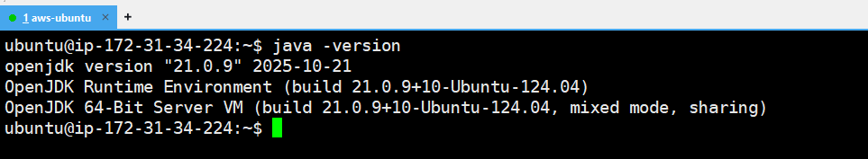
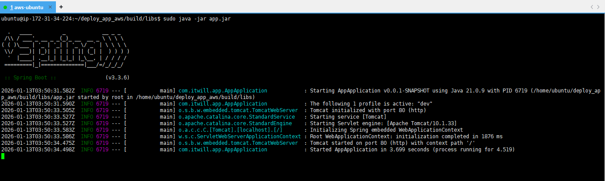
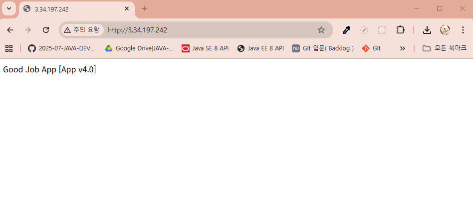
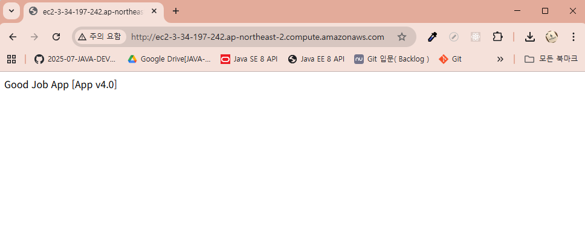

# 7-2. Spring Boot 서버를 EC2에 배포하기

### ✅ 1. Ubuntu 환경에서 JDK 설치하는 법

Spring Boot는 3.x.x 버전을 사용할 예정이고, JDK는 21버전을 사용할 예정이다. 그에 맞게 환경을 설치해보자. 

```bash
$ sudo apt update
$ sudo apt install openjdk-21-jdk -y
```

### ✅ 2. 잘 설치됐는 지 확인하기




### ✅ 3. Github으로부터 Spring Boot 프로젝트 clone하기

```bash
# aws-app-source/ 폴더파일삭제
$ rm -rf aws-app-source/
$ git clone https://github.com/2025-07-JAVA-DEVELOPER-162/aws-app-source.git
$ cd aws-app-source
```

### ✅ 5. 서버 실행시키기

```bash
$ chmod +x ./gradlew
$ ./gradlew clean build # 기존 빌드된 파일을 삭제하고 새롭게 JAR로 빌드
$ cd ~/aws-app-source/build/libs
$ sudo java -jar app.jar

```


참고) 백그라운드에서 Spring Boot 실행시키기
```bash
$ sudo nohup java -jar app.jar &
```

### ✅ 6. 잘 작동하는 지 확인하기

```bash
$ curl 127.0.0.1
Good Job  App [App v4.0]
```






