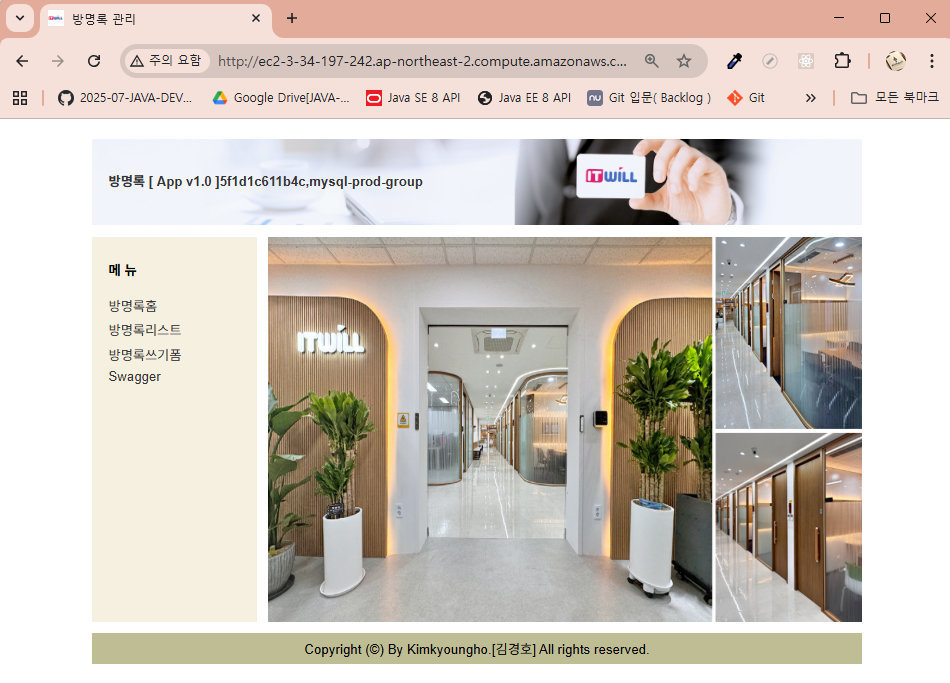
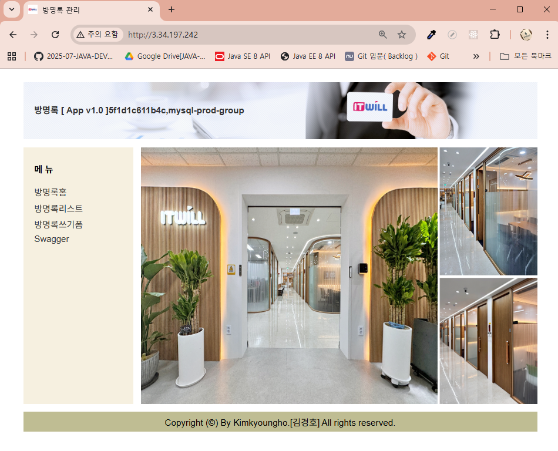

# 8. Spring Boot 서버를 EC2에서 docker compose 를 활용해 배포해보기

### ✅ 1. Ubuntu 환경에 JDK 설치

```bash
$ sudo apt update
$ sudo apt install openjdk-21-jdk -y

```

### ✅ 2. Ubuntu에서 Docker, Docker Compose 설치하기

```bash
sudo apt-get update && \
sudo apt-get install -y apt-transport-https ca-certificates curl software-properties-common && \
curl -fsSL https://download.docker.com/linux/ubuntu/gpg | sudo apt-key add - && \
sudo apt-key fingerprint 0EBFCD88 && \
sudo add-apt-repository "deb [arch=amd64] https://download.docker.com/linux/ubuntu $(lsb_release -cs) stable" && \
sudo apt-get update && \
sudo apt-get install -y docker-ce && \
sudo usermod -aG docker ubuntu && \
newgrp docker && \
sudo curl -L "https://github.com/docker/compose/releases/download/2.27.1/docker-compose-$(uname -s)-$(uname -m)" -o /usr/local/bin/docker-compose && \
sudo chmod +x /usr/local/bin/docker-compose && \
sudo ln -s /usr/local/bin/docker-compose /usr/bin/docker-compose

```


### ✅ 3. 잘 설치됐는 지 확인하기

```bash
$ java -version
$ docker -v # Docker 버전 확인
$ docker compose version # Docker Compose 버전 확인
```


### ✅ 4. Github으로부터 Spring Boot 프로젝트 clone하기

```bash
#디렉토리삭제
$ rm -rf aws-guest-source
$ git clone https://github.com/2025-07-JAVA-DEVELOPER-162/aws-guest-source.git
Cloning into 'aws-guest-source'...

```

### ✅ 5.  Spring Boot 프로젝트 빌드하기

```bash

$ cd aws-guest-source
$ chmod +x ./gradlew
# 기존 빌드된 파일을 삭제하고 새롭게 JAR로 빌드
$ ./gradlew clean build

```

### ✅ 6.도커컴포즈를사용해서 컨테이너생성

```bash
$ sudo chmod 666 /var/run/docker.sock
$ docker compose -f  docker-compose-guest-mysql.yml up -d
$ docker compose down
```

### ✅ 7.aws 주소(IP) 로 요청해서 확인 
     
http://ec2-3-34-197-242.ap-northeast-2.compute.amazonaws.com/



http://3.34.197.242




	 

