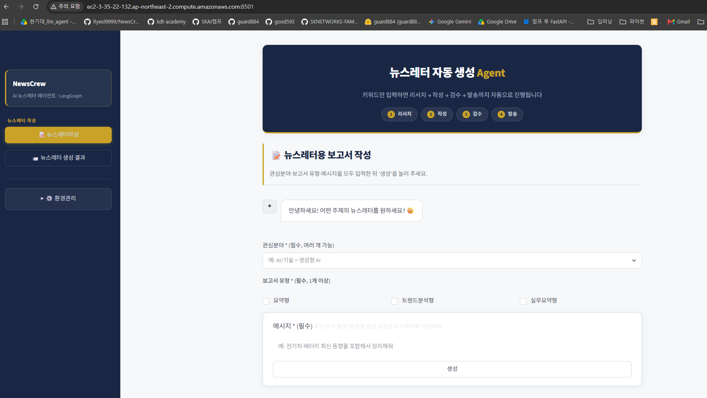
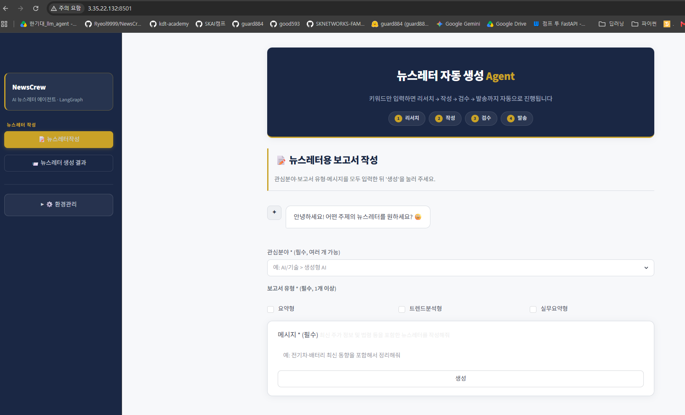

# 8. 파이썬 서버 클라이언트를 EC2에서 docker compose 를 활용해 배포해보기


### ✅ 1. Ubuntu에서 Docker, Docker Compose 설치하기

```bash
sudo apt-get update && \
sudo apt-get install -y ca-certificates curl && \
sudo install -m 0755 -d /etc/apt/keyrings && \
sudo curl -fsSL https://download.docker.com/linux/ubuntu/gpg -o /etc/apt/keyrings/docker.asc && \
sudo chmod a+r /etc/apt/keyrings/docker.asc && \
echo "deb [arch=$(dpkg --print-architecture) signed-by=/etc/apt/keyrings/docker.asc] https://download.docker.com/linux/ubuntu $(. /etc/os-release && echo "${UBUNTU_CODENAME:-$VERSION_CODENAME}") stable" | sudo tee /etc/apt/sources.list.d/docker.list > /dev/null && \
sudo apt-get update && \
sudo apt-get install -y docker-ce docker-ce-cli containerd.io docker-buildx-plugin docker-compose-plugin && \
sudo usermod -aG docker ubuntu

```


### ✅ 2. 잘 설치됐는 지 확인하기

```bash

$ docker -v # Docker 버전 확인
$ docker compose version # Docker Compose 버전 확인
```


### ✅ 4. Github으로부터  프로젝트 clone하기

```bash
#디렉토리삭제
$ rm -rf NewsCrew
$ git clone https://github.com/KDT-AGENT-ACADEMY-TEAM1/NewsCrew.git
Cloning into 'NewsCrew'..

$ cd NewsCrew
$ git fetch origin
$ git switch feature/guard

```
### ✅ 5. 도커컴포즈를사용해서 컨테이너생성

```bash

$ cd mysql
$ sudo chmod 666 /var/run/docker.sock


$ docker rmi mysql-app:latest

$ docker compose down
$ docker compose -f aws-docker-compose.yml up -d --build

```

### ✅ 6.aws 주소(IP) 로 요청해서 확인 
     
http://ec2-3-35-22-132.ap-northeast-2.compute.amazonaws.com:8501/



http://3.35.22.132:8501/




	 

